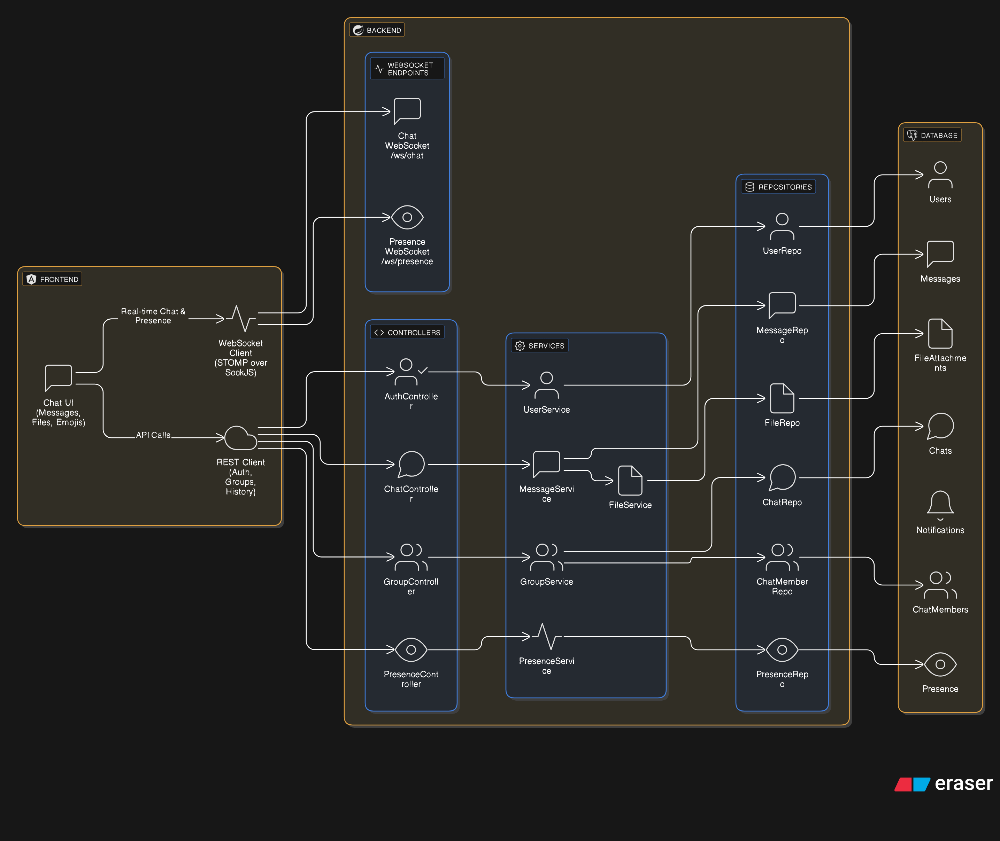
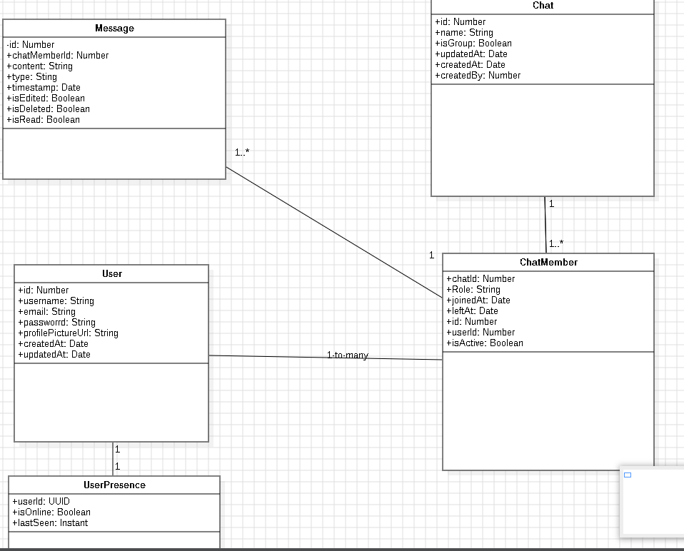

# 💬 Real-Time Messaging Module (Skote Platform)

This repository contains the **Real-Time Chat & Collaboration Module** developed for **Skote**, a comprehensive enterprise management platform.

---

## 📋 Project Overview

**Skote** is an enterprise-grade platform designed to streamline internal communication and management. Within the full ecosystem, employees can:

* Track progress across assigned projects
* Manage daily tasks and workflows
* Access income, financial insights, and internal mail

### 🎯 My Contribution

This module represents my work during my **Summer Internship at Arabsoft**. I was responsible for **designing and implementing the Real-Time Chat section**, enabling instant communication and collaboration between employees within Skote.

---

## 🏷️ Badges


---

## ✨ Key Features

* **Real-Time Communication** — Instant messaging using **WebSockets** (SockJS + RxStomp)
* **Private & Group Chats** — 1-on-1 conversations and group creation with admin/member roles
* **Presence System** — Live *Online / Offline* indicators with **Last Seen** tracking
* **Rich Media Support** — Text messages, emojis (Emoji Mart), images, and file attachments
* **Smart Notifications** — Toast alerts for new messages and group invitations
* **Modern UI** — Responsive layout with **Bootstrap 5** and **SCSS**
* **Security** — JWT / session-based authentication with **Spring Security**

---

## 🏗️ Architecture & Design

### Backend Architecture

Spring Boot backend handling REST APIs, WebSocket messaging, and database persistence.



### Class Diagram

Database entities and relationships (Users, Messages, Groups, Memberships, etc.).



---

## 🛠️ Tech Stack

### Frontend

* **Framework:** Angular 18 (Standalone Components)
* **Styling:** SCSS, Bootstrap 5
* **Reactive Programming:** RxJS
* **WebSocket Client:** `@stomp/rx-stomp`, `sockjs-client`

### Backend

* **Framework:** Spring Boot 3 (Java 17)
* **Database:** PostgreSQL 16
* **Security:** Spring Security, BCrypt
* **Real-Time Messaging:** Spring WebSocket (STOMP)
* **Build Tool:** Maven

---

## 🚀 Getting Started

### Prerequisites

* Node.js **v18+**
* Java **JDK 17+**
* PostgreSQL installed and running

---

### 1️⃣ Database Setup

Create a PostgreSQL database named `chatapp` (or update the configuration accordingly):

```sql
CREATE DATABASE chatapp;
```

---

### 2️⃣ Backend Setup

```bash
cd backend
# Configure database credentials in src/main/resources/application.properties
mvn clean install
mvn spring-boot:run
```

Backend runs at: **[http://localhost:8080](http://localhost:8080)**

---

### 3️⃣ Frontend Setup

```bash
cd frontend
npm install
ng serve
```

Frontend runs at: **[http://localhost:4200](http://localhost:4200)**

---

## 📸 Screenshots

### Main Chat Interface


### Create Group Modal


### Sending Media


### User Presence (Active Status)


---

## 📂 Project Structure

```text
├── backend/            # Spring Boot application
│   ├── src/main/java   # Controllers, Services, WebSocket config, Entities
│   └── src/main/res    # application.properties & resources
│
├── frontend/           # Angular application
│   ├── src/app/        # Components (Chat, Auth), Services (HTTP, WebSocket)
│   └── src/assets/     # Images & global styles
```

---

## 🤝 Contributing

Contributions, bug reports, and feature requests are welcome.

1. Fork the repository
2. Create your feature branch (`git checkout -b feature/my-feature`)
3. Commit your changes
4. Push to the branch
5. Open a Pull Request

---

## 📧 Contact

**Houcine**
GitHub: https://github.com/Houcine2023

---

> 💡 This module showcases real-time system design, WebSocket communication, and full-stack integration using Angular & Spring Boot — developed as part of an enterprise-grade platform during my internship at **Arabsoft**.
