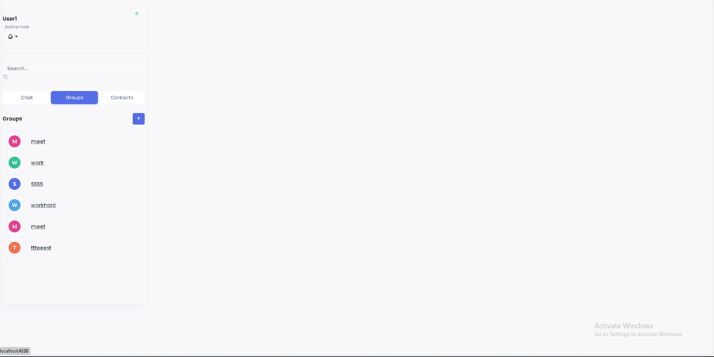
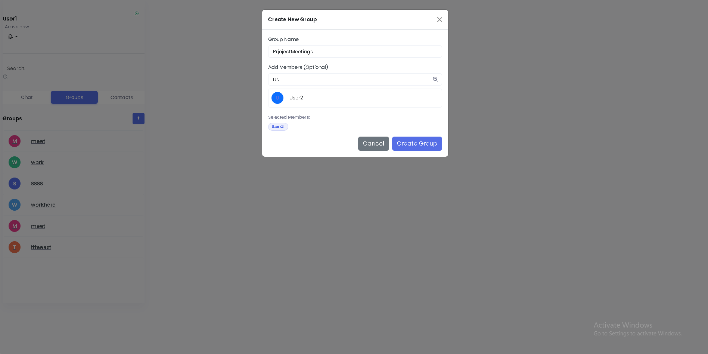
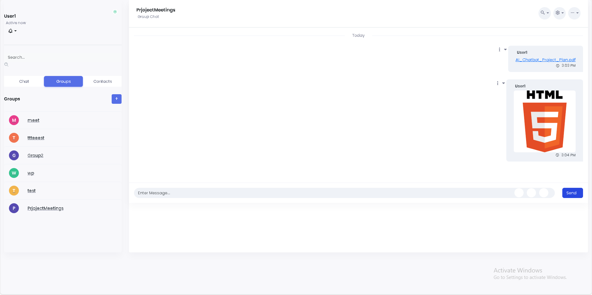
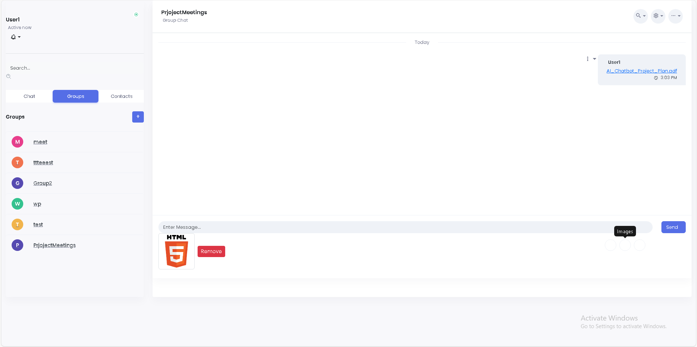

# 💬 Real-Time Messaging Module (Skote Platform)

This repository contains the **Real-Time Chat & Collaboration Module** developed for **Skote**, a comprehensive enterprise management platform.

### 📋 Project Context
**Skote** is a full-scale platform designed to facilitate internal communication and management for enterprises. In the full system, employees can:
* Track their progression in projects they are involved in.
* Manage daily tasks and workflows.
* View income, financial data, and internal mail.

**My Contribution:**
This specific project represents my work during my **Summer Internship at Arabsoft**. I was responsible for designing and building this **Real-Time Chat Section** to enable instant communication and collaboration between employees within the Skote ecosystem.


## ✨ Key Features

* **Real-Time Communication:** Instant messaging powered by **WebSockets** (SockJS + RxStomp).
* **Group & Private Chat:** Create groups, manage members (Admin privileges), or chat 1-on-1.
* **Presence System:** Real-time "Online/Offline" status indicators and "Last Seen" tracking.
* **Rich Media Support:** Send text, emojis (Emoji Mart integration), images, and file attachments.
* **Smart Notifications:** Toast notifications when added to groups or receiving new messages.
* **Modern UI:** Responsive design using **Bootstrap** and **SCSS**, with a polished sidebar/chat-window layout.
* **Security:** Secure authentication flow (JWT/Session-based) with Spring Security.

## 🏗️ Architecture & Design

### Backend Architecture
This diagram illustrates how the Spring Boot backend handles WebSocket connections, REST API requests, and database interactions.


### Class Diagram
An overview of the database models and their relationships (Users, Messages, Groups, etc.).


## 🛠️ Tech Stack

### Frontend
* **Framework:** Angular 18 (Standalone Components)
* **Styling:** SCSS, Bootstrap 5
* **State/Async:** RxJS
* **WebSocket Client:** @stomp/rx-stomp, sockjs-client

### Backend
* **Framework:** Spring Boot 3 (Java 17)
* **Database:** PostgreSQL
* **Security:** Spring Security, BCrypt
* **Real-time:** Spring WebSocket (STOMP messaging)
* **Build Tool:** Maven

## 🚀 Getting Started

### Prerequisites
* Node.js (v18+)
* Java JDK 17+
* PostgreSQL installed and running

### 1. Database Setup
Create a PostgreSQL database named `chatapp` (or update `application.properties` to match your existing DB).
```sql
CREATE DATABASE chatapp;


2. Backend Setup
Navigate to the backend folder and run the application.

cd backend
# Update src/main/resources/application.properties with your DB username/password
mvn clean install
mvn spring-boot:run

The backend will start on http://localhost:8080.

3. Frontend Setup
Navigate to the frontend folder, install dependencies, and start the server.

cd frontend
npm install
ng serve
Access the application at http://localhost:4200.


## 📸 Project Screenshots

**Main Chat Interface**


**Create Group Modal**


**Sending Media Examples**




**Tracking User Presence(Active Status)**


chat interface :


📂 Project Structure
├── backend/            # Spring Boot Application
│   ├── src/main/java   # Controllers, Services, WebSocket Config, Models
│   └── src/main/res    # Properties & Static Resources
│
├── frontend/           # Angular Application
│   ├── src/app/        # Components (Chat, Auth), Services (WebSocket, Http)
│   └── src/assets/     # Images & Global Styles

🤝 Contributing
Contributions, issues, and feature requests are welcome!

📧 Contact
Houcine - GitHub Profile